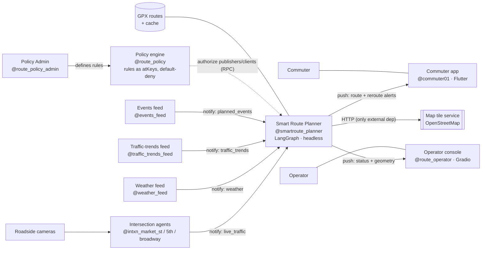

# Interaction diagrams — Smart Route Planning on the Atsign Platform

All communication is encrypted, identity-addressed, and port-less (no inbound ports).
Records flow under the `smartroute` namespace.

## Runtime sequence (publish → policy → reroute → push)

```mermaid
sequenceDiagram
    autonumber
    participant Cam as Roadside cameras
    participant I as Intersection agents<br/>@intxn_*
    participant F as Data feeds<br/>@weather/@traffic/@events
    participant POL as Policy engine<br/>@route_policy
    participant P as Smart Route Planner<br/>@smartroute_planner (LangGraph)
    participant C as Commuter app<br/>@commuter01 (Flutter)
    participant O as Operator console<br/>@route_operator (Gradio)

    POL-->>P: policy grant set (identity + role, default-deny)
    Cam->>I: local camera / sensor feed
    I-)P: live_traffic (encrypted notify)
    F-)P: weather / traffic_trends / planned_events (encrypted notify)
    Note over P: authorize sender vs policy<br/>drop if not granted; cache with TTL
    C->>P: request {source, destination}
    Note over P: LangGraph (reused, unmodified):<br/>shortest → static optimize → realtime reroute
    P-)C: route + reroute alert (push)
    P-)O: network status + route geometry (push)
    Note over C,O: both surfaces update live;<br/>incident clears on TTL (~60s)
```

## Component / data-flow view



> **Reuse note:** the Planner box is Intel's LangGraph agent, **unchanged**. Only the
> transport (how the boxes talk) was swapped — see KEEP/SWAP/ADD in `IMPLEMENTATION_PLAN.md`.
