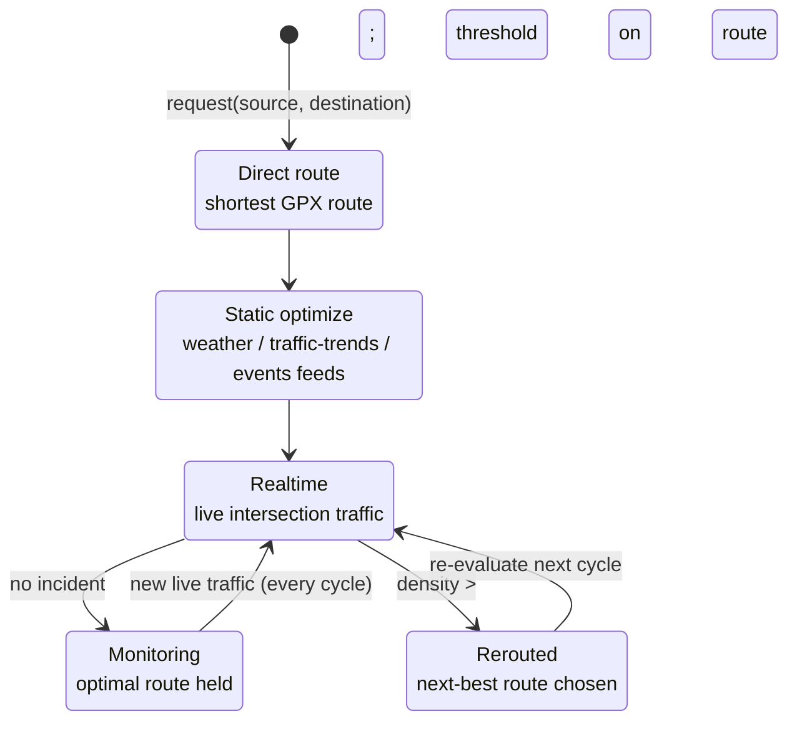
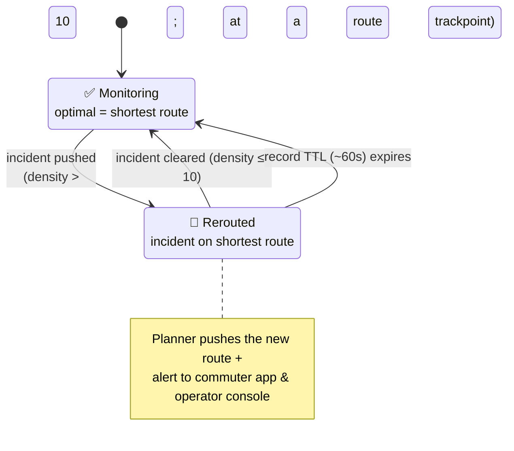
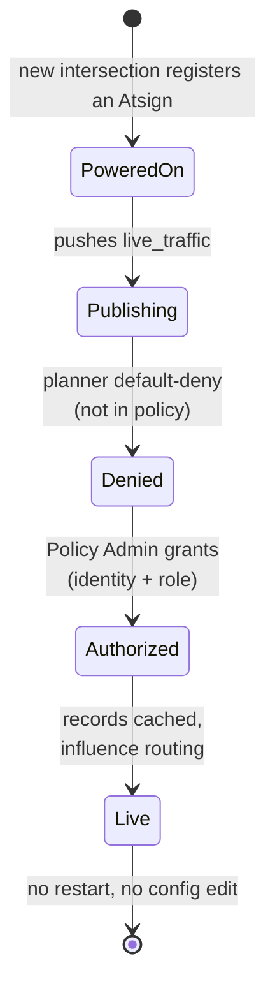
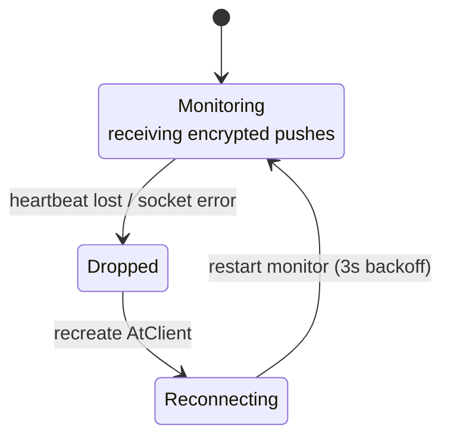

# State-flow diagrams — Smart Route Planning on the Atsign Platform

## 1. Planner route decision (Intel's LangGraph graph, reused)

## 2. Incident lifecycle (what a reroute looks like over time)

## 3. Policy-gated dynamic onboarding (a new intersection joins live)

## 4. Subscriber resilience (atSign monitor)

